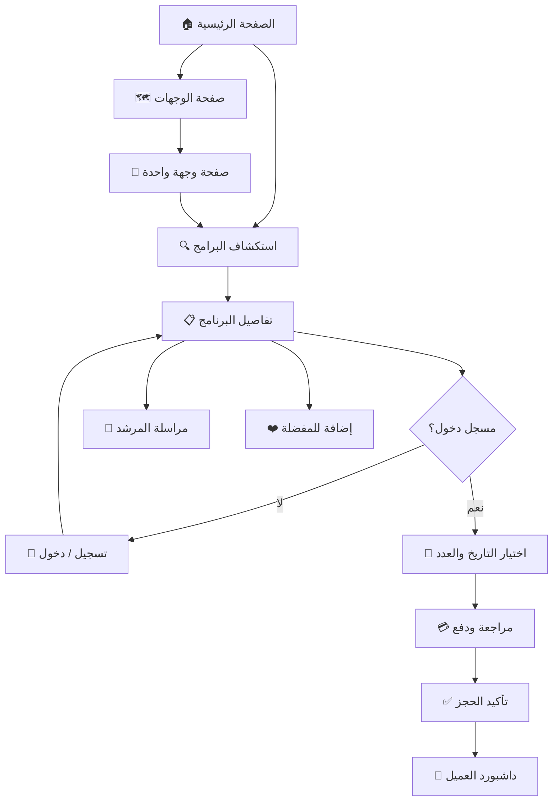
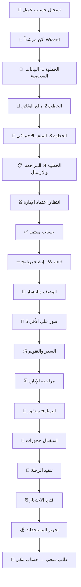
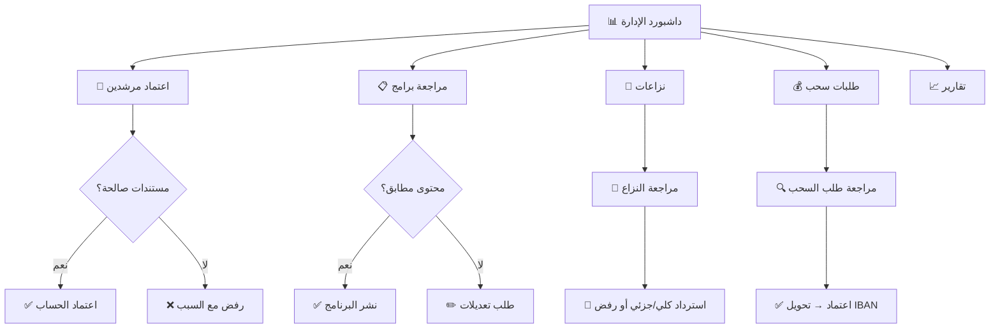
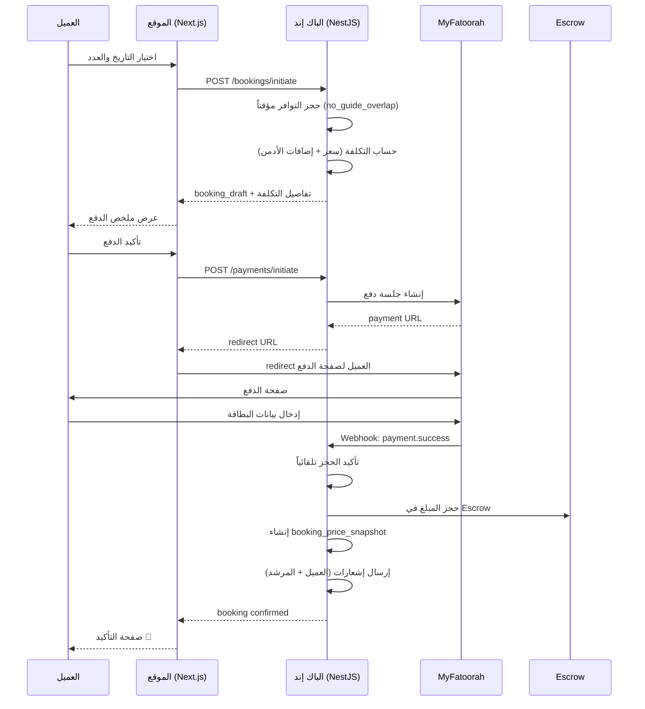
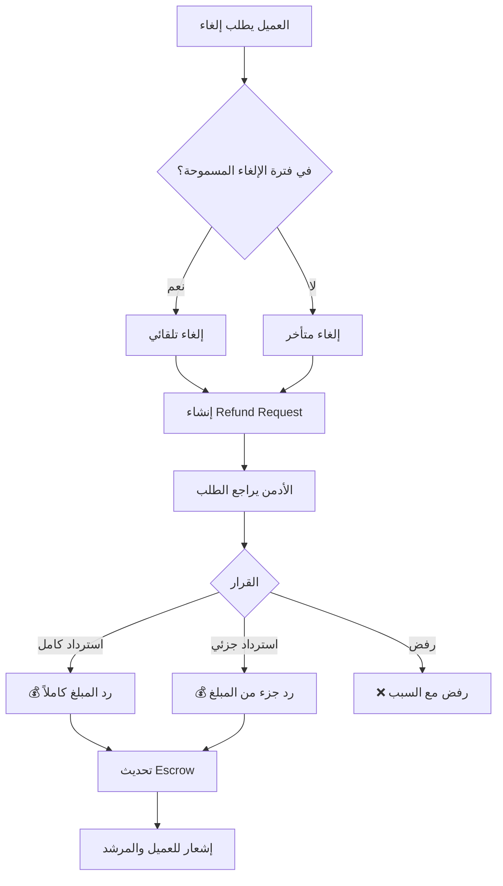

# 🔄 تدفقات المستخدم — User Flows

---

## Flow 1: رحلة العميل من الاكتشاف للحجز

### تفاصيل الخطوات
1. **الاكتشاف:** العميل يتصفح بدون حساب — يبحث بالوجهة والنشاط والتاريخ
2. **الاهتمام:** يفتح تفاصيل البرنامج — يشوف الصور والمسار والتقييمات
3. **القرار:** يقرر الحجز أو المراسلة أو الإضافة للمفضلة
4. **المصادقة:** يسجل/يدخل (OTP أو Email أو Social)
5. **الحجز:** يختار التاريخ والعدد → مراجعة التكلفة → الدفع عبر MyFatoorah
6. **التأكيد:** الحجز يتأكد تلقائياً ← إشعار للمرشد والعميل

---

## Flow 2: رحلة المرشد من التسجيل للأرباح

---

## Flow 3: رحلة الأدمن

---

## Flow 4: تدفق الحجز والدفع (Technical)

---

## Flow 5: تدفق الإلغاء والاسترداد

